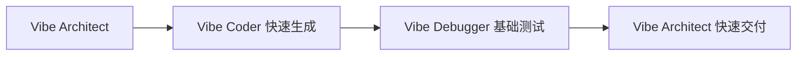

<div align="center">

# 🎹 Vibe Coding Team SKILL

[](https://github.com/yangmeishux/vibe-coding-team/releases)
[](LICENSE)
[](https://claude.com/claude-code)
[](https://github.com/yangmeishux/vibe-coding-team/stargazers)
[](https://github.com/yangmeishux/vibe-coding-team/issues)

**🎨 AI 协作的 Vibe Coding 系统 - 从"如何实现"转向"需要什么"**

基于 Andrej Karpathy 的 Vibe Coding 理念，通过 6 个专业 AI Agent 协作，实现自然语言驱动的软件开发

[功能介绍](#-核心功能) • [快速开始](#-快速开始) • [使用示例](#-使用示例) • [文档](#-文档) • [贡献](#-贡献)

English • 简体中文

</div>

---

## ✨ 什么是 Vibe Coding？

🤔 **传统编程的痛点**：
- 需要精通语法、算法、框架
- 从需求到代码需要大量手动工作
- 开发周期长，迭代成本高
- 技术门槛高，非开发者难以参与

✅ **Vibe Coding 的优势**：
- 🎯 **自然语言驱动**：用中文描述需求，AI 自动生成代码
- 🎭 **专业 Agent 团队**：6 个专业 AI 各司其职，协作完成开发
- 🔄 **四阶段工作流**：创意 → 生成 → 调试 → 审查，质量有保障
- ⚡ **快速原型**：数小时将想法转化为可运行的应用
- 🎹 **指挥家模式**：你负责表达意图和把控质量，AI 负责执行细节

<div align="center">

**从代码工匠到 AI 协作指挥家，开发方式质的飞跃！**

</div>

---

## 📊 核心功能

### 🎭 6 大专业 Agent

| Agent | 角色 | 🎯 核心能力 | ⚡ 使用场景 |
|:-----:|:-----:|:-----------|:-----------|
| **Vibe Architect** | 架构指挥官 | 需求分析、架构设计、技术选型、团队协调 | 项目启动、架构决策、多 Agent 协调 |
| **Vibe Coder** | 编码乐手 | 代码生成、功能实现、设计模式应用 | API 开发、业务逻辑、模块实现 |
| **Vibe Reviewer** | 质量守门人 | 代码审查、安全检查、性能评估 | 质量保证、安全审计、性能优化 |
| **Vibe Debugger** | 调试专家 | 错误诊断、测试生成、问题修复 | Bug 修复、测试覆盖、问题排查 |
| **Vibe Documenter** | 文档生成器 | API 文档、架构说明、决策记录 | 文档生成、知识管理、最佳实践 |
| **Security-Advisor** | 安全顾问 | 漏洞扫描、安全加固、认证审查 | 安全审计、渗透测试、合规检查 |

### 🔄 三种使用方式

#### 方式 1️⃣: 让架构师协调（推荐用于完整项目）

```bash
[vibe-architect] 我需要开发一个电商平台的用户系统，支持：
  - 用户注册和登录（JWT 认证）
  - 个人信息管理
  - 订单历史查询
  请协调团队完成开发
```

**Vibe Architect 自动**：
- ✅ 分析需求，设计架构
- ✅ 定义模块和接口
- ✅ 协调 Agent 并行开发
- ✅ 设置质量检查点
- ✅ 整合最终输出

#### 方式 2️⃣: 指定特定 Agent（推荐用于单一任务）

```bash
[vibe-architect] 设计一个 RESTful API 的用户认证系统

[@vibe-coder] 实现用户登录和注册的 API 端点

[@vibe-reviewer] 审查这段代码的安全性和性能

[@vibe-debugger] 生成单元测试和集成测试

[@vibe-documenter] 生成 API 文档和使用示例
```

#### 方式 3️⃣: 任务分类（快速模式）

```bash
[task:planning] 设计一个博客系统的后端架构

[task:coding] 实现文章的 CRUD 接口

[task:review] 检查评论功能的安全性

[task:debugging] 修复支付接口的错误并生成测试

[task:documentation] 生成 API 文档
```

---

## 🚀 快速开始

### 📥 安装

<details>
<summary><b>方式 1: Git 克隆（推荐）</b></summary>

```bash
# 进入 Claude Code SKILLS 目录
cd ~/.claude/skills

# 克隆仓库
git clone https://github.com/yangmeishux/vibe-coding-team.git

# 验证安装
ls vibe-coding-team/SKILL.md  # 应该显示文件存在
```

</details>

<details>
<summary><b>方式 2: 手动下载</b></summary>

1. 访问 [Releases](https://github.com/yangmeishux/vibe-coding-team/releases) 页面
2. 下载最新版本的 ZIP 文件
3. 解压到 `~/.claude/skills/` 目录
4. 确保文件夹名为 `vibe-coding-team`

</details>

<details>
<summary><b>方式 3: 复制文件（最简单）</b></summary>

```bash
# Windows PowerShell
Copy-Item -Path "vibe-coding-team" -Destination "$env:USERPROFILE\.claude\skills\" -Recurse

# Linux/Mac
cp -r vibe-coding-team ~/.claude/skills/
```

</details>

### ✅ 验证安装

```bash
# 启动 Claude Code
claude

# 测试 SKILL
> [vibe-architect] 测试一下 Vibe Coding Team 是否正常工作
```

如果看到 Agent 团队响应，说明安装成功！

---

## 📚 学习资源

### 🚀 快速上手（推荐新手）

**[10 分钟快速上手指南](examples/quick-start/QUICK_START.md)**
- Part 1: 10 分钟快速上手（立即体验）
- Part 2: 深入理解（详细原理）

**[项目示例](examples/project-examples/)**
- 📘 [TODO API](examples/project-examples/todo-api/README.md) - 简化版，演示工作流程（15-30 分钟）
- 📗 [博客系统](examples/project-examples/blog-system/README.md) - 完整可运行版本（1-2 小时）
- 📙 [任务管理 UI](examples/project-examples/task-ui/README.md) - 前端开发示例（1-2 小时）

### 🎬 视频演示

**[视频演示脚本](examples/resources/video-demos/demo-scripts.md)**
- 脚本 1: 项目介绍（3 分钟）
- 脚本 2: 快速上手演示（5 分钟）
- 脚本 3: 完整项目开发流程（10 分钟）
- 脚本 4: 高级功能和最佳实践（15 分钟）

### 📖 详细文档

- **[使用示例](examples/usage_examples.md)** - 详细的使用示例和场景
- **[最佳实践](examples/best-practices/)** ⭐ 核心技能
  - **[Context Engineering 指南](examples/best-practices/context-engineering.md)** - 如何提供高质量上下文
  - **[Prompt Engineering 指南](examples/best-practices/prompt-engineering.md)** - 如何编写有效提示词
- **[测试指南](examples/TESTING_GUIDE.md)** 🧪 功能测试报告和验证流程
- **[快速参考卡片](QUICK_REFERENCE.md)** - 常用命令和技巧
- **[SKILL 配置](SKILL.md)** - Agent 定义和工作流程
- **[更新日志](CHANGELOG.md)** - 版本历史和变更记录

---

## 🔥 OpenCode 使用

Vibe Coding Team SKILL 已完美集成到 OpenCode 平台，提供更强大的 AI 协作能力。

### 在 OpenCode 中使用

#### 1️⃣ 自动激活

OpenCode 会自动识别并加载已安装的 SKILL，无需额外配置。

#### 2️⃣ 触发方式

在 OpenCode 中，Vibe Coding Team 可以通过以下方式触发：

```bash
# 方式 1: 直接调用（推荐）
[vibe-architect] 我需要开发一个用户管理系统

# 方式 2: 任务分类
[task:coding] 实现用户认证功能

# 方式 3: 指定 Agent
[@vibe-coder] 生成登录接口代码
[@vibe-reviewer] 审查这段代码
[@vibe-debugger] 修复这个 bug
[@vibe-documenter] 生成 API 文档
```

#### 3️⃣ OpenCode 优势

- 🚀 **并行执行**: OpenCode 可以并行调度多个 Agent，大幅提升效率
- 📊 **进度可视化**: 实时查看各 Agent 的工作进度和状态
- 🔄 **会话管理**: 自动保存会话上下文，支持断点续传
- 🎯 **智能路由**: OpenCode 会根据任务类型自动选择最合适的 Agent
- 📝 **结果追踪**: 所有输出自动归档，方便回顾和复用

#### 4️⃣ OpenCode 工作流示例

```bash
# 启动 OpenCode
opencode

# 使用 Vibe Coding Team
> [vibe-architect] 我需要开发一个任务管理应用，支持：
  - 任务创建、编辑、删除
  - 任务状态管理
  - 任务标签和优先级
  使用 React + Node.js + MongoDB

# OpenCode 会自动：
# ✅ 识别 [vibe-architect] 触发器
# ✅ 调用 vibe-architect Agent 进行需求分析
# ✅ 并行协调其他 Agent 执行任务
# ✅ 实时显示进度和状态
# ✅ 整合所有结果
```

#### 5️⃣ 与 OpenCode SKILL 配合

Vibe Coding Team 可以与其他 OpenCode SKILL 无缝配合：

```bash
# 完整开发管道
[vibe-architect] 开发 Web 应用
  ↓ (自动触发)
[vibe-coder] 实现功能
  ↓
/vibe-coding-team    # Agent 团队协作
  ↓
/playwright          # 端到端测试
  ↓
/obsidian-markdown   # 格式化文档
  ↓
/docx                # 生成 Word 文档
  ↓
/pdf                 # 导出 PDF
```

### OpenCode 高级功能

#### 会话管理

```bash
# 查看活跃会话
> session list

# 继续之前的会话
> [vibe-architect] 继续之前的任务，优化用户认证模块

# OpenCode 会自动加载之前的上下文
```

#### 后台任务

```bash
# 启动后台任务
> [vibe-architect] 并行开发以下模块：
  - 用户服务（后台任务 1）
  - 商品服务（后台任务 2）
  - 订单服务（后台任务 3）

# OpenCode 会在后台并行执行，不影响你的其他工作
```

#### 结果追溯

```bash
# 查看特定 Agent 的输出
> show vibe-coder output from session ses_abc123

# 查看完整的开发历史
> history --agent vibe-architect --last 10
```

---

## 💡 使用示例

### 示例 1️⃣: 快速原型开发（OpenCode 版）

```bash
# 启动 Claude Code
claude

# 让架构师协调团队完成快速原型
> [vibe-architect] 我想快速开发一个简单的任务管理应用，支持：
  - 任务的创建、编辑、删除
  - 任务状态管理（待办、进行中、已完成）
  - 任务标签和分类
  使用 React + Node.js + MongoDB，请协调团队完成
```

**执行流程（OpenCode 增强）**：
```
Phase 1: 需求分析与架构设计
  ├─ Vibe Architect → 分析需求、设计架构、定义接口
  └─ Vibe Architect → 选择技术栈（React + Node.js + MongoDB）

Phase 2: 代码生成（OpenCode 并行）
  ├─ Vibe Coder → 生成后端 API（Express + MongoDB） [并行任务 1]
  └─ Vibe Coder → 生成前端组件（React） [并行任务 2]

Phase 3: 质量保证（OpenCode 并行）
  ├─ Vibe Reviewer → 审查代码质量、安全性、性能 [并行任务 1]
  └─ Vibe Debugger → 生成测试用例 [并行任务 2]

Phase 4: 文档生成
  ├─ Vibe Documenter → 生成 API 文档
  └─ Vibe Documenter → 生成使用说明

Phase 5: 最终交付
  └─ Vibe Architect → 整合并质量把控

OpenCode 特性:
  ✅ 自动并行执行独立任务
  ✅ 实时进度可视化
  ✅ 自动保存会话状态
  ✅ 支持断点续传

总耗时: 约 1.5-2 小时（并行执行）
产出: 可运行的任务管理应用 + 测试 + 完整文档
```

### 示例 2️⃣: API 开发

```bash
# 需求分析
> [task:planning] 设计一个电商平台的商品管理 API，需要支持：
  - 商品的创建、读取、更新、删除（CRUD）
  - 商品分类和标签
  - 商品搜索和过滤
  - 库存管理
  使用 Node.js + Express + MongoDB

# 代码生成
> [task:coding] 实现商品的 CRUD API 端点

# 代码审查
> [task:review] 检查 API 的安全性（SQL 注入、XSS）和性能

# 文档生成
> [task:documentation] 生成完整的 API 文档和使用示例
```

**产出**：
- ✅ 完整的商品管理 API
- ✅ 安全性和性能评估报告
- ✅ 全面的 API 文档
- ✅ 使用示例和最佳实践

### 示例 3️⃣: Bug 修复

```bash
# 错误诊断
> [task:debugging] 这个登录接口总是返回 500 错误，错误日志如下：
  Error: Cannot read property 'password' of undefined
  at /routes/auth.js:25
  请分析问题并提供修复方案

# Vibe Debugger 会：
# 1. 分析错误日志和代码
# 2. 定位问题根源
# 3. 提供修复方案
# 4. 生成测试用例
# 5. 验证修复效果
```

---

## 📚 工作流程

### 标准 Vibe Coding 流程


### 快速原型流程



---

## 🎯 最佳实践

### ✅ DO (推荐做法)

1. **明确需求和约束**
   ```bash
   ❌ [vibe-architect] 做个博客
   ✅ [vibe-architect] 设计一个博客系统，支持用户认证、文章管理、评论功能，
     使用 Node.js + Express + MongoDB，需要 RESTful API 和响应式前端
   ```

2. **合理选择使用方式**
   ```bash
   完整项目 → 让 vibe-architect 协调团队
   单一任务 → 直接指定特定 Agent
   快速开发 → 使用 [task:category] 快速模式
   ```

3. **遵循工作流程**
   ```
   架构先行（vibe-architect → vibe-coder）
   质量跟进（vibe-reviewer）
   测试保障（vibe-debugger）
   文档完善（vibe-documenter）
   ```

4. **提供具体反馈**
   ```bash
   ✅ [@vibe-reviewer] 这段代码存在 SQL 注入风险，需要使用参数化查询
   ✅ [@vibe-coder] 这个 API 响应格式不符合 RESTful 规范，需要调整
   ✅ [@vibe-debugger] 测试覆盖不够，需要添加边界情况测试
   ```

### ❌ DON'T (避免做法)

1. ❌ 对简单任务使用全部 Agent（效率低）
2. ❌ 跳过架构设计直接编码（技术债务）
3. ❌ 忽略代码审查和质量检查（风险高）
4. ❌ 省略测试和文档（维护难）
5. ❌ 完全信任 AI 不进行人工审查（不可靠）

---

## 🔗 与其他 SKILL 配合

### 完整开发管道（OpenCode）

```bash
/planning-with-files     # 1. 制定项目计划
  ↓
/vibe-coding-team        # 2. Agent 团队协作开发（OpenCode 并行）
  ↓
/playwright              # 3. 端到端测试
  ↓
/obsidian-markdown      # 4. 格式化为笔记
  ↓
/docx                   # 5. 生成 Word 文档
  ↓
/pdf                    # 6. 导出 PDF
```

### API 开发管道（OpenCode）

```bash
/vibe-coding-team        # 1. 开发 API（OpenCode 并行）
  ↓
/playwright              # 2. API 测试
  ↓
/obsidian-markdown      # 3. 生成 API 文档
  ↓
/docx                   # 4. 导出 API 规范
```

### 快速原型管道（OpenCode）

```bash
/vibe-coding-team        # 1. 快速开发原型（OpenCode 并行）
  ↓
/playwright              # 2. 基础功能测试
  ↓
/docx                   # 3. 生成使用文档
```

---

## 🌟 核心特性

- ✅ **自然语言驱动**：用中文描述需求，无需写代码
- ✅ **专业 Agent 团队**：6 个专业 AI 各司其职，质量有保障
- ✅ **结构化流程**：四阶段工作流，从需求到交付
- ✅ **多层质量检查**：架构、代码、测试、文档全方位把控
- ✅ **快速原型开发**：数小时将想法转化为可运行应用
- ✅ **完整文档生成**：自动生成 API 文档、架构说明、使用手册
- ✅ **灵活协作模式**：可与其他 SKILL 配合，构建完整开发流程
- ✅ **OpenCode 深度集成**：支持并行执行、进度可视化、会话管理
- ✅ **持续更新**：活跃维护和功能迭代

---

## 📈 路线图

### v1.1 (当前版本) ✅
- ✅ 6 个核心 Agent（新增 Security-Advisor 安全顾问）
- ✅ 三种使用方式
- ✅ 完整工作流程
- ✅ 质量检查机制
- ✅ 详细文档

### v1.2 (计划中) 🚧
- ⏳ 添加更多 Agent（Performance-Optimizer, DevOps-Engineer）
- ⏳ 支持自定义 Agent 角色
- ⏳ 优化并行处理逻辑
- ⏳ 添加项目模板和最佳实践库

### v2.0 (未来) 🔮
- 🔮 Web UI 控制面板
- 🔮 项目状态可视化
- 🔮 自定义工作流程编辑器
- 🔮 插件系统和扩展机制

---

## 📁 项目结构

```
vibe-coding-team/
├── .github/
│   ├── workflows/          # GitHub Actions 配置
│   │   └── ci.yml          # 持续集成
│   ├── ISSUE_TEMPLATE/     # Issue 模板
│   │   └── feedback.md     # 用户反馈模板
│   └── PULL_REQUEST_TEMPLATE.md  # PR 模板
├── examples/               # 使用示例和教程
│   ├── quick-start/        # 快速上手教程
│   │   └── QUICK_START.md  # 10 分钟上手指南
│   ├── best-practices/     # 最佳实践指南 ⭐ NEW
│   │   ├── context-engineering.md  # Context Engineering 指南
│   │   ├── prompt-engineering.md   # Prompt Engineering 指南
│   │   └── README.md
│   ├── project-examples/   # 项目示例
│   │   ├── todo-api/       # TODO API (简化版)
│   │   ├── blog-system/    # 博客系统 (完整版)
│   │   └── task-ui/        # 任务管理 UI (前端版)
│   ├── resources/          # 资源文件
│   │   └── video-demos/    # 视频演示脚本
│   │       └── demo-scripts.md
│   └── usage_examples.md   # 使用示例
├── SKILL.md                # SKILL 配置文件（核心）
├── README.md               # 项目说明（本文件）
├── README_EN.md            # 英文版说明
├── QUICK_REFERENCE.md      # 快速参考卡片
├── CHANGELOG.md            # 更新日志
├── CONTRIBUTING.md         # 贡献指南
├── LICENSE                 # MIT 许可证
└── .gitignore              # Git 忽略配置
```

---

## 🎯 适用场景

| 场景 | 适合度 | 说明 |
|------|--------|------|
| **快速原型开发** | ⭐⭐⭐⭐⭐ | 数小时将想法转化为可运行原型 |
| **个人工具/脚本** | ⭐⭐⭐⭐⭐ | 完美适合快速实现小工具 |
| **内部工具/MVP** | ⭐⭐⭐⭐⭐ | 快速验证和迭代 |
| **概念验证（POC）** | ⭐⭐⭐⭐⭐ | 验证技术可行性 |
| **学习和技术调研** | ⭐⭐⭐⭐⭐ | 通过对话理解新技术 |
| **API 开发** | ⭐⭐⭐⭐ | 快速生成 RESTful API |
| **UI/UX 原型** | ⭐⭐⭐⭐ | 配合 Figma MCP 快速生成界面 |
| **小型 SaaS 应用** | ⭐⭐⭐ | 适合，但需要适当的架构规划 |
| **中大型企业应用** | ⭐⭐ | 需要结合传统工程方法 |
| **高安全性系统** | ⭐ | 不推荐，需要严格的安全审查 |

---

## 🤝 贡献

我们欢迎各种形式的贡献！

### 如何贡献？

1. 🍴 Fork 本仓库
2. 🌿 创建特性分支 (`git checkout -b feature/AmazingFeature`)
3. 💾 提交更改 (`git commit -m 'Add some AmazingFeature'`)
4. 📤 推送到分支 (`git push origin feature/AmazingFeature`)
5. 🔀 开启 Pull Request

详细指南请查看 [CONTRIBUTING.md](CONTRIBUTING.md)

### 贡献者

感谢所有贡献者！

<a href="https://github.com/yangmeishux/vibe-coding-team/graphs/contributors">
  
</a>

---

## 📝 许可证

本项目基于 [MIT License](LICENSE) 开源

```
Copyright (c) 2026 Vibe Coding Team Community

Permission is hereby granted, free of charge, to any person obtaining a copy
of this software and associated documentation files (the "Software"), to deal
in the Software without restriction...
```

---

## 🙏 致谢

- **灵感来源**: [Andrej Karpathy](https://twitter.com/karpathy) - Vibe Coding 理念的提出者
- **基础架构**: [ai-agent-team](https://github.com/Sunnyeung369/ai-agent-team) - AI Agent 协作框架
- **Claude Code**: [Anthropic](https://www.anthropic.com) - Claude Code CLI
- **社区实践**: 所有分享 Vibe Coding 经验的开发者和研究者

---

## 📮 联系方式

- **项目主页**: [https://github.com/yangmeishux/vibe-coding-team](https://github.com/yangmeishux/vibe-coding-team)
- **问题反馈**: [Issues](https://github.com/yangmeishux/vibe-coding-team/issues)
- **功能建议**: [Discussions](https://github.com/yangmeishux/vibe-coding-team/discussions)

---

## 🌟 如果这个项目对你有帮助

请给它一个 ⭐ **Star**！这会让更多人发现这个项目。

也欢迎分享给你的朋友和同事！

---

<div align="center">

**从"如何实现"转向"需要什么"**<br>
**让 AI 成为你的编码乐手，你成为指挥家**

[⬆ 返回顶部](#-vibe-coding-team-skill) • [📖 文档](#-文档) • [🤝 贡献](#-贡献)

</div>
